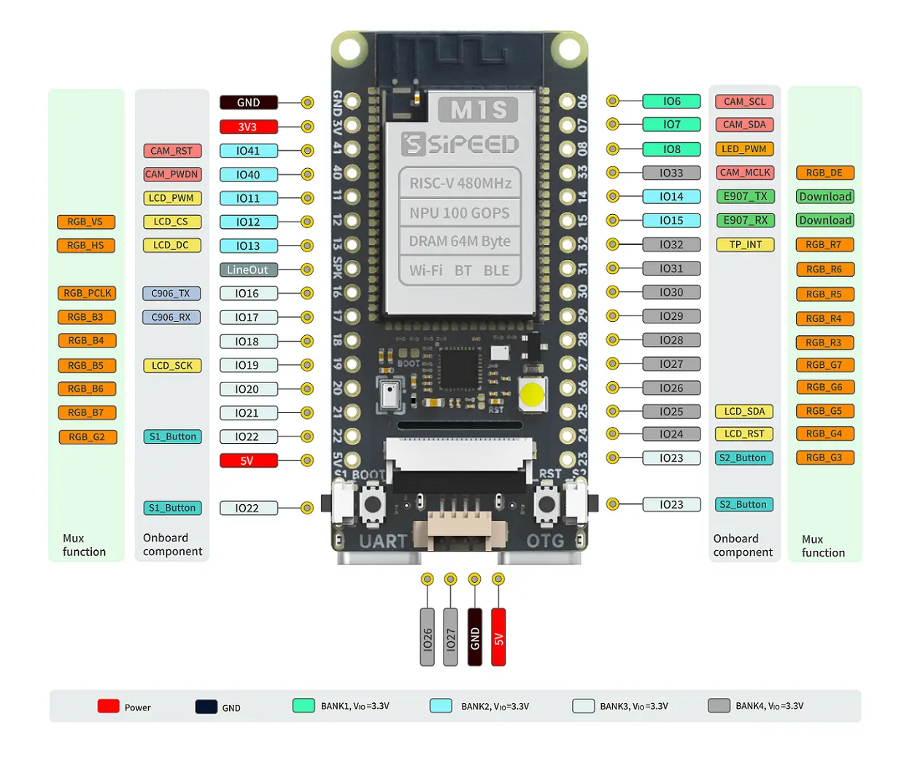

.. zephyr:board:: m1s_dock

Overview
********

   Sipeed M1S Dock

The Sipeed M1S Dock is a development board based on the Bouffalo Lab BL808
SoC.  The BL808 features a 32-bit RISC-V CPU (T-Head E907) running at up to
320 MHz with 224 KB of SRAM, Wi-Fi, BLE 5.0, and a hardware security engine.

The M1S Dock includes an 8 MB flash (GD25LQ64), USB-C connector, two user
buttons, one user LED, and exposes GPIO pins for peripheral access.

Hardware
********

- SoC: BL808 (T-Head E907, RV32IMAFCP, 320 MHz)
- RAM: 224 KB SRAM
- Flash: 8 MB SPI NOR (GD25LQ64)
- LED: 1 user LED on GPIO8
- Buttons: 2 user buttons on GPIO22 and GPIO23
- Console: UART0 at 115200 baud

For more information about the Bouffalo Lab BL808 SoC:

- `Bouffalo Lab BL808 Datasheet`_

Supported Features
==================

.. zephyr:board-supported-hw::

System Clock
============

The M1S Dock is configured to run at 320 MHz.

Serial Port
===========

The ``m1s_dock`` board uses UART0 as the default serial port, accessible via
the USB-C connector.

Programming and Debugging
*************************

.. zephyr:board-supported-runners::

Flashing
========

#. Build and flash the :zephyr:code-sample:`hello_world` sample application:

   .. zephyr-app-commands::
      :zephyr-app: samples/hello_world
      :board: m1s_dock
      :goals: build flash

#. Run your favorite terminal program to listen for output. For example:

   .. code-block:: console

      $ minicom -D /dev/ttyACM0 -o

   Connection should be configured as follows:

      - Speed: 115200
      - Data: 8 bits
      - Parity: None
      - Stop bits: 1

   Then, press and release the RST button:

   .. code-block:: console

      *** Booting Zephyr OS build v4.1.0 ***
      Hello World! m1s_dock/bl808c09q2i

.. _Bouffalo Lab BL808 Datasheet:
	https://github.com/bouffalolab/bl_docs/tree/main/BL808_DS/en
